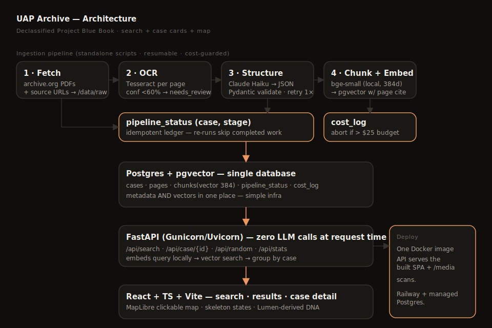

# UAP Archive

**A friendly, searchable layer over declassified U.S. government UFO files.**

Real U.S. Air Force **Project Blue Book** case files are public — but they live in
unusable government catalog interfaces and image-only scans. UAP Archive makes them
searchable in plain English and presents each one as a clean, story-like "case card"
with an AI-generated plain-language summary and a link straight back to the original
scanned document.

> Type a question like *"strange lights over New Mexico in the 1950s"* → get ranked
> declassified case files, a clickable map of where they happened, and one-click access
> to the original government scans.



---

## What this project demonstrates

- **Semantic search** over OCR'd historical documents (local embeddings + pgvector).
- **RAG-style summarization with citations** — every AI summary is grounded in document
  text and ends with a source link; the app never asserts extraordinary claims.
- **Resumable, idempotent ETL** — a 4-stage pipeline with a per-`(case, stage)` status
  ledger and a hard cost ceiling on LLM spend.
- **Pragmatic infra** — one Postgres+pgvector database for metadata *and* vectors; one
  Docker image that serves the API, the SPA, and the document scans.
- **Design with intent** — a warm-dark editorial-technical UI (three-typeface system,
  single accent, annotated-diagram map) driven by a locked [`design.md`](design.md).

---

## Architecture

| Layer | Tech | Notes |
|---|---|---|
| Ingestion | Standalone Python scripts | Runs **outside** the API process; resumable |
| OCR | Tesseract (`pytesseract`) + `pdftoppm` | Per-page text + confidence; `<60%` → `needs_review` |
| Summaries / extraction | Anthropic Claude (Haiku) | Cheap model, batched, **cached** — never re-summarizes unchanged text |
| Embeddings | `bge-small-en-v1.5` (local, 384-dim) | **Free, no API key.** Anthropic has no embeddings API. |
| Store | Postgres + `pgvector` | Single DB for metadata + vectors |
| API | FastAPI + Gunicorn/Uvicorn | **Zero LLM calls at request time** — summaries are precomputed |
| Frontend | React + TypeScript + Vite | MapLibre map, skeleton loaders, mobile-first |
| Deploy | Docker → Railway | One image serves API + SPA + scans |

**Why local embeddings?** The original brief specified Anthropic for embeddings, but
Anthropic does not offer an embeddings API. Using a local `bge-small` model eliminates a
paid dependency and drops ingestion embedding cost to **$0**.

**Why no LLM at request time?** Summaries and structured data are generated once during
ingestion and stored in Postgres. Visitors read cached text, so live traffic costs **$0**
in API spend and pages render instantly.

---

## Data sources & terms of use

- **Primary corpus:** U.S. Air Force **Project Blue Book** UFO investigation case files,
  originally **NARA microfilm T1206** (Record Group 341). These are U.S. federal government
  records and are in the **public domain**.
- **Access mirror:** the digitized files are fetched from the
  [`project-blue-book` collection on the Internet Archive](https://archive.org/details/project-blue-book),
  a public mirror of the NARA microfilm. Individual items are downloaded via the
  archive.org metadata/download API with a polite User-Agent and backoff.
- **Curation of the "unidentified" set:** archive.org is *not* pre-filtered to the ~701
  officially "unidentified" cases. The seed list is curated by cross-referencing Brad
  Sparks' publicly available *Comprehensive Catalog of Project Blue Book UFO Unknowns*
  with well-documented cases (see [`ingestion/data_sources/unidentified_seed.txt`](ingestion/data_sources/unidentified_seed.txt)),
  and can be expanded via collection query.
- **Attribution:** every displayed page links back to its archive.org source, and each AI
  summary ends with `Case {id} — {archive link}`. Provenance (including `NARA T1206`) is
  stored per case in `/data/raw/{case_id}/source.json`.

This project is a non-commercial research/portfolio tool. It presents public records; it
does not host any private or restricted material.

---

## Guardrails

- **No fabricated content.** If OCR is too poor to summarize confidently, the UI shows
  *"Original document available — text extraction incomplete"* instead of an AI summary.
- **Confidence gate.** Pages under 60% mean OCR confidence are flagged `needs_review`
  rather than silently ingested as garbage.
- **Cost ceiling.** The extract stage meters estimated Anthropic spend into `cost_log`
  and **aborts the run** if projected total cost exceeds `$25` (configurable). A
  `--dry-run-cost` mode estimates spend before you pay anything.
- **Idempotency.** Every stage is tracked per `(case, stage)`; re-running a script skips
  completed work.
- **Secrets via env only.** Nothing is committed; see [`.env.example`](.env.example).

---

## Run it locally

### Option A — Docker (everything, including Postgres+pgvector)

```bash
cp .env.example .env          # add your ANTHROPIC_API_KEY
docker compose up --build     # API + SPA at http://localhost:8000
```

Then seed + ingest (in another shell, into the running stack):

```bash
docker compose exec app python -m ingestion.seed_cases \
  --from-file ingestion/data_sources/unidentified_seed.txt
docker compose exec app python -m ingestion.run --stage all
```

### Option B — Local dev (hot-reload frontend)

```bash
# 1. Postgres + pgvector
docker run -d --name uap-db -p 5432:5432 \
  -e POSTGRES_USER=uap -e POSTGRES_PASSWORD=uap -e POSTGRES_DB=uap_archive \
  pgvector/pgvector:pg16

# 2. Backend
python3.11 -m venv .venv && source .venv/bin/activate
pip install -r requirements.txt
cp .env.example .env          # add ANTHROPIC_API_KEY
uvicorn backend.app.main:app --reload --port 8000

# 3. Frontend (separate shell)
cd frontend && npm install && npm run dev   # http://localhost:5173
```

Requires system `tesseract` and `poppler` (`pdftoppm`) for the pipeline:
`brew install tesseract poppler` (macOS) or `apt-get install tesseract-ocr poppler-utils`.

---

## Run the ingestion pipeline

The pipeline is four resumable stages. Run them all, or one at a time.

```bash
# Register the case list to ingest (idempotent)
python -m ingestion.seed_cases --from-file ingestion/data_sources/unidentified_seed.txt
#   ...or expand from the collection:
python -m ingestion.seed_cases --query "unidentified" --limit 50

# Estimate LLM cost BEFORE spending anything
python -m ingestion.run --stage extract --dry-run-cost

# Full pipeline (fetch → ocr → extract → embed)
python -m ingestion.run --stage all

# Or run a single stage (each skips already-completed cases)
python -m ingestion.run --stage fetch
python -m ingestion.run --stage ocr
python -m ingestion.run --stage extract
python -m ingestion.run --stage embed
```

**Stages:**

1. **fetch** — download PDF + metadata → `/data/raw/{case_id}/`, record source URLs.
2. **ocr** — render pages (`pdftoppm`), OCR (Tesseract), store per-page text + confidence,
   flag low-confidence pages.
3. **extract** — Claude → validated Pydantic JSON (date, location, shape, duration,
   witness type, conclusion, summaries). Validation failure → retry once → mark
   `extraction_failed`. Geocodes city/state to lat/long (offline) for the map.
4. **embed** — chunk (~500 tok / 50 overlap), embed locally, store in pgvector with
   `case_id` + `page_number` so results cite an exact page.

---

## API

Base path `/api` (single container) or `http://localhost:8000` (backend-only dev).

| Endpoint | Purpose |
|---|---|
| `GET /search?q=` | Embed query, vector-search top 20 chunks, group by case, rank |
| `GET /case/{id}` | Full structured data + page-level text + links to original scans |
| `GET /random` | One random case (powers "Case of the Day") |
| `GET /stats` | Counts by decade, state, shape |
| `GET /healthz` | Liveness (used by Railway healthcheck) |

Interactive docs at `/api/docs`.

---

## Deploy to Railway

1. Push this repo to GitHub.
2. In Railway: **New Project → Deploy from GitHub repo** (uses [`railway.json`](railway.json) +
   `Dockerfile`).
3. Add a **PostgreSQL** plugin, then enable pgvector: `CREATE EXTENSION vector;`
   (the app also runs `schema.sql`, which does this).
4. Set environment variables (from `.env.example`): `DATABASE_URL` (Railway provides it),
   `ANTHROPIC_API_KEY`, `DATA_DIR`.
5. Deploy. Healthcheck path is `/api/healthz`.

Run ingestion once via Railway's shell (or locally against the managed DB) to populate the
archive. Live traffic makes no LLM calls, so hosting stays a few dollars a month.

---

## Project layout

```
backend/app/        FastAPI app, config, DB pool, Pydantic models, local embeddings
ingestion/          seed_cases.py, run.py (runner), pipeline/ (fetch, ocr, extract, embed,
                    state=idempotency+cost guard, geocode)
db/schema.sql       Postgres + pgvector schema
frontend/           React + TS + Vite (MapLibre map, case cards, skeletons)
design.md           Locked design system (Lumen-derived DNA)
docs/architecture.svg
Dockerfile, docker-compose.yml, railway.json, .env.example
```

---

## Roadmap (out of scope for MVP)

- Scale beyond the curated set to the full unidentified corpus.
- HNSW/IVFFlat tuning (trivial at current scale; noted for growth).
- Faceted filtering (decade / state / shape) wired to `/stats`.
- Full-text fallback search alongside semantic search.

---

*Documents are U.S. government public records (Project Blue Book / NARA T1206). This is an
independent research and portfolio project, not affiliated with any government agency.*
